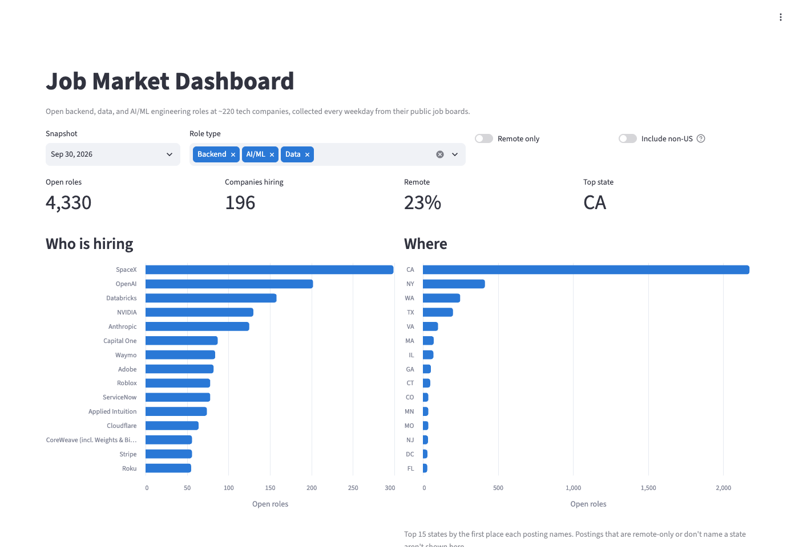

# Job Market Dashboard

Tracks open backend, data, and AI/ML engineering roles at ~220 tech companies, one snapshot per weekday,
and turns them into hiring trends: who is hiring, for what, and where.

**Live demo: [nk-job-market.streamlit.app](https://nk-job-market.streamlit.app/)** (it may take ~30 seconds to wake up)



## Run it

```bash
python -m venv .venv && .venv/bin/pip install -r requirements.txt
.venv/bin/streamlit run app.py
```

## How it works

```
data/snapshots/*.csv.gz ──► sql/models/stg_jobs.sql ──► app.py (Streamlit + Altair)
  one file per weekday       cleaned: state, remote,      who is hiring, where,
                             non-US flag, role flags      role types over time, postings
```

- **Collection:** a scheduled job checks each company's public job board and saves every open matching role.
- **Cleaning:** `stg_jobs` turns messy location text ("US, CA, Santa Clara", "San Diego, CALIFORNIA",
  "3 Locations (primary: …)") into a US state using lookup tables in `data/reference/`, and flags remote
  and non-US postings. `sql/03_locations.sql` checks the result (84.6% of postings get a state).
- **Dashboard:** DuckDB runs SQL directly on the gzipped CSVs; there is no database server.

## Transformations (dbt)

The cleaning also lives in a [dbt](https://www.getdbt.com/) project in `transform/`, with tests that run on every build:

```
source: raw.snapshots ─► stg_snapshots ─► int_location_states ─┐
seeds: us_states, us_cities, non_us_places ────────────────────┴► fct_open_roles ─► agg_daily_roles
```

- **30 tests**: one row per job per day, no rows lost or duplicated by joins, every state is a real state code,
  lookup tables have no duplicates, and a warning if fewer than 90% of placed US postings resolve to a state.
- **State matching runs once per distinct location** (905 of them), not once per job per day, so builds stay fast
  as snapshots accumulate (17 s → 2 s on the first day already).

```bash
.venv/bin/pip install -r requirements-dbt.txt
cd transform && ../.venv/bin/dbt build --profiles-dir .
```

To explore with SQL: `.venv/bin/python run_sql.py sql/models/stg_jobs.sql sql/03_locations.sql`

## Data

`data/snapshots/YYYY-MM-DD.csv.gz` — every open matching role on that day, one row per posting:

| column | meaning |
|---|---|
| snapshot_date | day the snapshot was taken (UTC) |
| company | employer |
| ats | hiring system the posting came from (greenhouse, lever, ashby, workday, …) |
| job_key | stable id for the posting (`ats:company:job_id`) |
| title | job title as posted |
| tracks | role type: Backend, Data, AI/ML (a title can have several) |
| location | location text as posted |
| country | country when the hiring system provides one |
| posted_at | posting date as reported by the hiring system (Workday gives day precision at best) |
| url | link to the posting |

All of it comes from the companies' public job boards.
